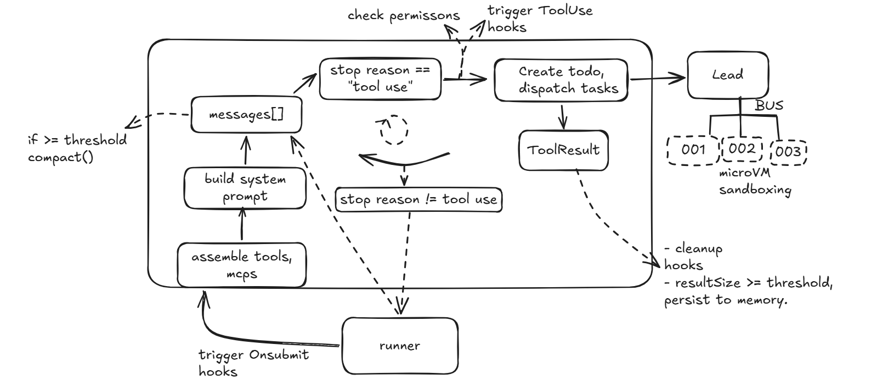
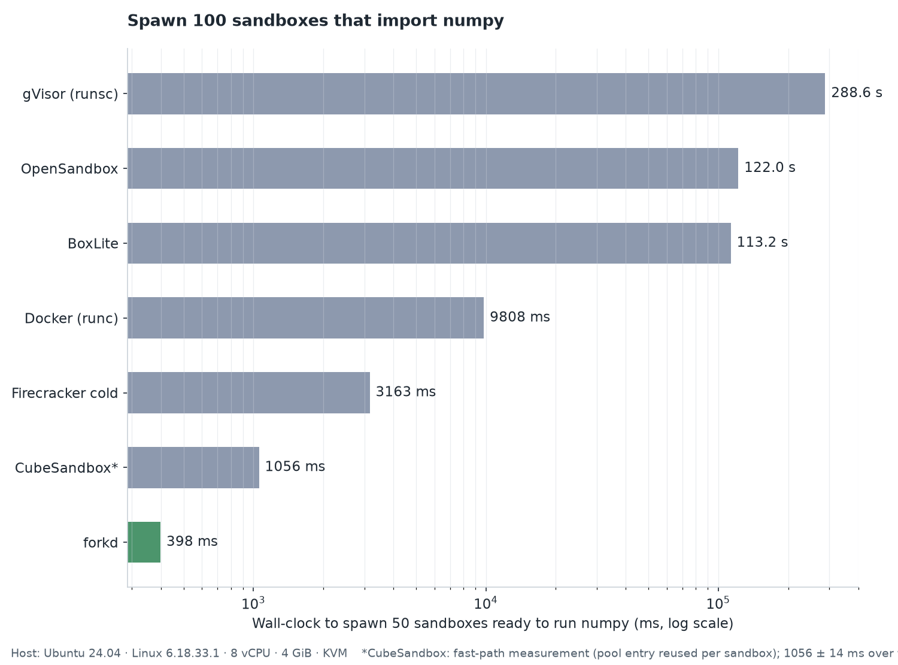
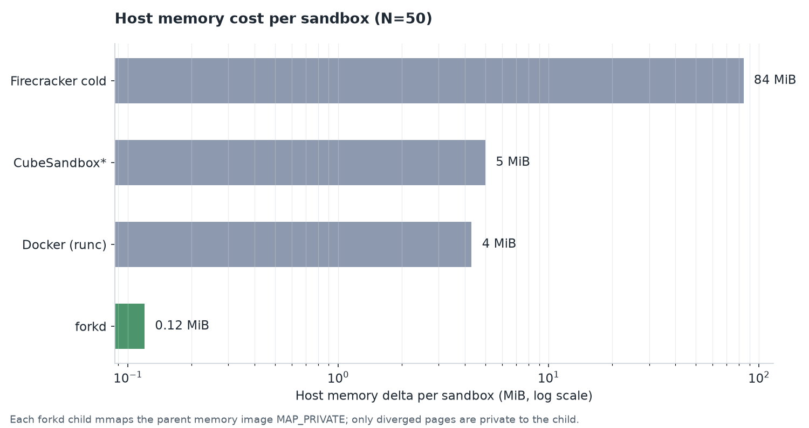

# smol-harness
[](LICENSE)



smol agent harness built atop OpenRouter, with out-of-the-box sandboxing capabilities for subagent management using [`forkd()`](https://github.com/deeplethe/forkd). 


<p align="center"><i>Built using Textual.</i><p align="center">

## MicroVM Setup

forkd is a microVM runtime built on [Firecracker](https://github.com/firecracker-microvm/firecracker) which allows spawning shortlived processes with shared parent memory. It takes advantage of `mmap --MAP_PRIVATE` to spawn isolated an child process of the firecracker KVM (already booted with `python` and `numpy`) with an already running python process copied over from snapshot state. Branches out, resumes parent and child VMs, runs tools(loop), appends content back to `messages[]`, exit.  

### Why forkd

#### Bench


Spawn 50 sandboxes, each ready to execute `numpy.zeros(5).tolist()`. Measure wall-clock from the first sandbox request to the last sandbox confirming the result.

Host hardware:
- Ubuntu 24.04
- Linux 6.33.18.1
- 8 vCPU
- 4 GiB RAM
- KVM enabled



<p align="center"><i>Total memory usage per backend.</i><p align="center">

with beefier compute: [forkd's published benchmarks](https://github.com/deeplethe/forkd/tree/main/bench) 


### Prerequisites

- x86_64 Linux with KVM enabled (`/dev/kvm` must exist)
- Ubuntu 22.04 or newer (WSL is fine)

### 1. Install forkd

Download the latest CLI + controller binaries:

```bash
curl -sSL https://github.com/deeplethe/forkd/releases/download/v0.5.2/forkd-v0.5.2-x86_64-linux.tar.gz \
  | sudo tar -xz -C /usr/local/bin/
```

### 2. Install the Python SDK

```bash
uv venv venv
source .venv/bin/activate
uv add forkd
```

### 3. Verify your install

`forkd doctor` runs 17 checks: KVM, hardware virt, cgroup v2, Firecracker binary, kernel image, controller reachability e.t.c Fix anything it flags before continuing:

```bash
forkd doctor
```

All checks should pass green. If any fail, scripts are provided at source https://github.com/deeplethe/forkd to fix/navigate issues, such as follows in 4.

### 4. Set up host networking (one-time)

```bash
git clone https://github.com/deeplethe/forkd.git
cd forkd
sudo bash scripts/setup-host.sh          # KVM + tap device
sudo bash scripts/netns-setup.sh 3       # per-child network namespaces
```

### 5. Generate and export your token

The controller requires a bearer token for all API calls. Generate one and export it into your shell:

```bash
sudo mkdir -p /etc/forkd
sudo bash -c 'head -c 32 /dev/urandom | base64 > /etc/forkd/token'
sudo chmod 600 /etc/forkd/token
```
then 

```bash
sudo cat /etc/forkd/token
```
to get the `FORKD_TOKEN` and add to `.envrc`. Configure your `MODEL_ID`, `FALLBACK_MODEL_ID` with OpenRouter Model_ID names (as well as other necessary credentials)

```bash
direnv allow .
```
to export the environment variables.

Then Finally,

```bash
uv runner/main.py --tui
```
to begin the agent loop.


## License
MIT
